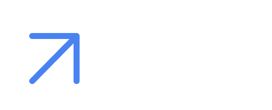

<div align="center">



# Eleva Clínicas

### Sistemas de Gestão Sob Medida para Clínicas

**Transforme a gestão da sua clínica com tecnologia personalizada**

[](https://nextjs.org/)
[](https://www.typescriptlang.org/)
[](https://tailwindcss.com/)
[](https://greensock.com/gsap/)

[🌐 Ver Demo](https://73code.com.br) • [📧 Contato](mailto:contato@73code.com.br) • [💬 WhatsApp](https://wa.me/5511999999999)

</div>

---

## 🎯 Sobre o Projeto

O **Eleva Clínicas** é uma plataforma web moderna e responsiva desenvolvida para apresentar soluções de gestão personalizadas para clínicas terapêuticas, odontológicas e estéticas. O site foi construído com foco em **performance**, **experiência do usuário** e **conversão**.

### 🌟 Proposta de Valor

> **Organizamos agenda, operação e atendimento com tecnologia adaptada à sua realidade**

Diferente de sistemas genéricos, oferecemos soluções sob medida que se adaptam ao fluxo de trabalho único de cada clínica, eliminando tarefas repetitivas e aumentando a produtividade.

---

## ✨ Características Principais

### 🎨 Design & UX

- **Design System Profissional** - Paleta de cores harmoniosa com gradientes modernos
- **Animações Fluidas** - Micro-interações com GSAP para experiência premium
- **Responsivo** - Otimizado para desktop, tablet e mobile
- **Acessibilidade** - Seguindo as melhores práticas WCAG
- **Dark Mode Ready** - Preparado para tema escuro

### 🚀 Performance

- **Next.js 15** - Framework React de última geração
- **Server Components** - Renderização otimizada no servidor
- **Image Optimization** - Carregamento inteligente de imagens
- **Code Splitting** - Divisão automática de código
- **SEO Otimizado** - Meta tags, sitemap e robots.txt configurados

### 🌐 Internacionalização

- **Português** e **Inglês** - Troca de idioma em tempo real
- **Context API** - Gerenciamento de estado global
- **Conteúdo Localizado** - Textos adaptados para cada idioma

### 📝 Blog Integrado

- **MDX Support** - Markdown com componentes React
- **SEO Automático** - Meta tags geradas automaticamente
- **Sitemap Dinâmico** - Atualização automática com novos posts
- **Syntax Highlighting** - Código formatado com Prism.js

---

## 🏗️ Arquitetura

```
eleva-clinica-site/
├── 📁 public/
│   ├── assets/          # Imagens, logos e ícones
│   ├── fonts/           # Fontes customizadas (Radio Grotesk)
│   └── images/          # Imagens do blog
├── 📁 src/
│   ├── app/             # App Router (Next.js 15)
│   │   ├── blog/        # Páginas do blog
│   │   ├── layout.tsx   # Layout raiz
│   │   └── page.tsx     # Página inicial
│   ├── components/
│   │   ├── sections/    # Seções da landing page
│   │   ├── ui/          # Componentes reutilizáveis
│   │   └── backgrounds/ # Efeitos visuais
│   ├── contexts/        # Context API (Language)
│   ├── data/            # Conteúdo estático
│   ├── hooks/           # Custom hooks
│   └── lib/             # Utilitários e helpers
├── 📁 content/
│   └── posts/           # Posts do blog em MDX
└── 📁 scripts/          # Scripts Python para automação
```

---

## 🛠️ Tecnologias

### Core

- **[Next.js 15](https://nextjs.org/)** - Framework React com App Router
- **[TypeScript](https://www.typescriptlang.org/)** - Tipagem estática
- **[React 19](https://react.dev/)** - Biblioteca UI

### Styling

- **[Tailwind CSS](https://tailwindcss.com/)** - Framework CSS utility-first
- **[Radix UI](https://www.radix-ui.com/)** - Componentes acessíveis
- **Custom Design System** - Tokens de design personalizados

### Animações

- **[GSAP](https://greensock.com/gsap/)** - Animações de alta performance
- **[Framer Motion](https://www.framer.com/motion/)** - Animações declarativas
- **Custom Animations** - Micro-interações personalizadas

### Content & SEO

- **[MDX](https://mdxjs.com/)** - Markdown + JSX para blog
- **[next-mdx-remote](https://github.com/hashicorp/next-mdx-remote)** - Renderização MDX
- **JSON-LD** - Schema markup para SEO
- **Sitemap & Robots.txt** - Otimização para crawlers

### Ferramentas

- **[pnpm](https://pnpm.io/)** - Gerenciador de pacotes rápido
- **[ESLint](https://eslint.org/)** - Linting de código
- **[Prettier](https://prettier.io/)** - Formatação de código

---

## 🚀 Começando

### Pré-requisitos

- **Node.js** 18.17 ou superior
- **pnpm** 8.0 ou superior (recomendado)

### Instalação

```bash
# Clone o repositório
git clone https://github.com/natan-goliveira/eleva-clinica-site.git

# Entre no diretório
cd eleva-clinica-site

# Instale as dependências
pnpm install

# Rode o servidor de desenvolvimento
pnpm dev
```

Abra [http://localhost:3000](http://localhost:3000) no navegador para ver o resultado.

### Scripts Disponíveis

```bash
pnpm dev          # Inicia o servidor de desenvolvimento
pnpm build        # Cria build de produção
pnpm start        # Inicia servidor de produção
pnpm lint         # Executa o linter
```

---

## 📂 Seções do Site

### 🏠 Hero Section
Apresentação impactante com animações fluidas e CTA destacado

### 👥 Para Quem
Público-alvo: clínicas terapêuticas, odontológicas e estéticas

### ⚠️ O Problema
Dores do mercado: sistemas genéricos, tarefas manuais, falta de integração

### 💡 Nossa Abordagem
Metodologia personalizada e focada em resultados

### 📦 O que Entregamos
Soluções completas: agenda inteligente, prontuário eletrônico, automação

### 💻 Sistema
Demonstração visual da plataforma com mockups interativos

### 📞 CTA Final
Call-to-action para agendamento de demonstração

---

## 🎨 Design System

### Paleta de Cores

```css
--primary: #4169E1;      /* Royal Blue */
--secondary: #427CFA;    /* Bright Blue */
--dark: #0E172A;         /* Deep Navy */
--text: #1A1A2E;         /* Dark Gray */
--accent: #6B8DD6;       /* Light Blue */
```

### Tipografia

- **Radio Grotesk** - Títulos e destaques
- **DM Sans** - Corpo de texto
- **Geist Mono** - Código e elementos técnicos

### Componentes

- Header com mega menu animado
- Cards com hover effects
- Botões com micro-animações
- Backgrounds com efeitos de luz
- Tooltips e badges personalizados

---

## 📱 Responsividade

O site é totalmente responsivo com breakpoints otimizados:

- **Mobile**: < 768px
- **Tablet**: 768px - 1024px
- **Desktop**: > 1024px
- **Wide**: > 1440px

---

## 🔍 SEO & Performance

### Otimizações Implementadas

✅ Meta tags dinâmicas por página  
✅ Open Graph para redes sociais  
✅ Twitter Cards  
✅ Sitemap XML automático  
✅ Robots.txt configurado  
✅ Schema.org JSON-LD  
✅ Lazy loading de imagens  
✅ Otimização de fontes  
✅ Code splitting automático  
✅ Compressão de assets  

---

## 📝 Blog

O blog utiliza **MDX** para permitir componentes React dentro do Markdown:

```markdown
---
title: "Título do Post"
description: "Descrição SEO"
date: "2024-01-01"
author: "Autor"
tags: ["tag1", "tag2"]
---

# Conteúdo do Post

Texto com **formatação** e componentes React!
```

### Adicionar Novo Post

1. Crie um arquivo `.md` em `content/posts/`
2. Adicione o frontmatter YAML
3. Escreva o conteúdo em Markdown
4. O sitemap será atualizado automaticamente

---

## 🌍 Deploy

### Vercel (Recomendado)

[](https://vercel.com/new/clone?repository-url=https://github.com/natan-goliveira/eleva-clinica-site)

### Outras Plataformas

O site pode ser deployado em qualquer plataforma que suporte Next.js:

- **Netlify**
- **AWS Amplify**
- **Railway**
- **Render**

---

## 🤝 Contribuindo

Contribuições são bem-vindas! Sinta-se à vontade para:

1. Fazer um fork do projeto
2. Criar uma branch para sua feature (`git checkout -b feature/AmazingFeature`)
3. Commit suas mudanças (`git commit -m 'Add some AmazingFeature'`)
4. Push para a branch (`git push origin feature/AmazingFeature`)
5. Abrir um Pull Request

---

## 📄 Licença

Este projeto é proprietário e confidencial. Todos os direitos reservados © 2026 Eleva Clínicas.

---

## 📞 Contato

**Eleva Clínicas**

- 🌐 Website: [73code.com.br](https://73code.com.br)
- 📧 Email: contato@73code.com.br
- 💬 WhatsApp: [+55 11 99999-9999](https://wa.me/5511999999999)

---

<div align="center">

**Desenvolvido com ❤️ usando Next.js e TypeScript**

⭐ Se este projeto foi útil, considere dar uma estrela!

</div>
